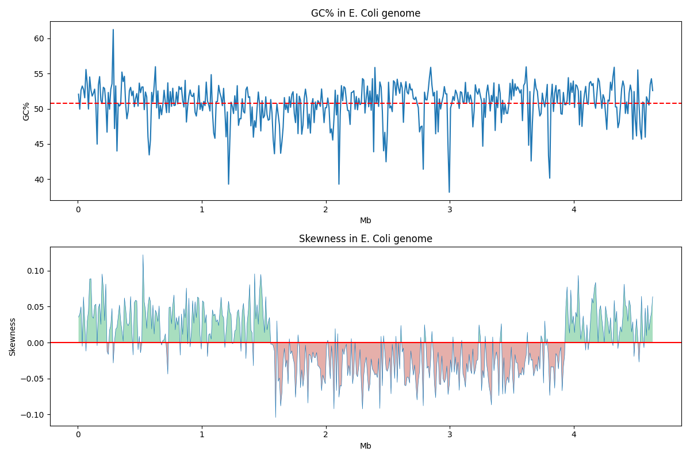

# Genomic GC-Content & GC-Skew Analyzer

A fast and efficient Python tool for analyzing and visualizing the GC-content and GC-skew of bacterial genomes (such as *E. coli*) using a sliding window approach. 

This script parses a genome assembly, calculates nucleotide distributions, and generates publication-ready visualizations to help identify structural genomic features like the origin of replication.

## Features

* **Sliding Window Analysis:** Iterates through whole-genome sequences in user-defined window sizes (e.g., 10,000 bp).
* **High Performance:** Optimized nucleotide counting using native Python string methods.
* **Dual Metrics:**
    * **GC-Content:** The percentage of Guanine and Cytosine bases.
    * **GC-Skew:** The asymmetric distribution of G and C, calculated using the formula $GC_{skew} = \frac{G - C}{G + C}$.
* **Publication-Ready Visualizations:** Generates stacked subplots with `matplotlib`, including color-filled skew regions to clearly distinguish leading and lagging strands.


## Biological Context

In bacterial genomes with a single origin of replication (like *E. coli*), DNA replication proceeds bidirectionally. Due to mutational biases during replication, the **leading strand** tends to accumulate more Guanine (G), while the **lagging strand** accumulates more Cytosine (C). 

By plotting the **GC-skew**, we can visually identify the Origin of Replication (oriC) and the replication terminus-the exact points where the graph crosses the zero axis and changes polarity.

## Dependencies

The script requires Python 3.x and the following libraries:

* `biopython` (for reading FASTA files)
* `numpy` (for statistical calculations)
* `matplotlib` (for data visualization)

Install the dependencies using pip:

```bash
pip install biopython numpy matplotlib
